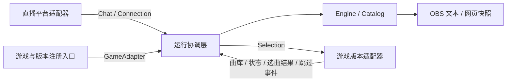

# 适配层与扩展方式

这次拆分保留原有安装方式、TOML、点歌命令、队列行为和 OBS 界面。目标是让新增游戏或版本时，改动集中在适配模块与注册入口；搜索、排队、交互和网页不需要认识游戏内存。

目前仍然只支持 Bilibili 和已验证的 IIDX 33 构建。所有适配器编译在同一个 DLL 内，没有外部插件 ABI、动态插件加载或 Cargo feature 选择要求。

## 模块边界

| 位置 | 职责 |
|---|---|
| `src/platforms/mod.rs` | `ChatSource`、平台无关的消息与连接状态、平台构造入口 |
| `src/platforms/bilibili.rs` | Bilibili 身份、鉴权、WebSocket、心跳、重连、去重 |
| `src/game.rs` | 游戏适配契约与可拥有的数据，不包含内存指针或游戏枚举 |
| `src/games/mod.rs` | 根据已验证指纹模式匹配，构造游戏与版本适配器 |
| `src/games/iidx/mod.rs` | IIDX 的 SP/DP、难度命令、显示颜色与难度编号转换 |
| `src/games/iidx/controls.rs` | IIDX 的对侧 Start 编号与双击识别 |
| `src/games/iidx/v33/` | 当前构建的 hook、结构偏移、曲库解析、原生搜索字典和线程邮箱 |
| `src/host/` | Windows 模块读取与指纹、通用 Spice SDK 按键读取 |
| `src/runtime.rs` | 启停、轮询适配器、分发消息、日志与输出协调 |
| `src/engine.rs`、`src/catalog.rs` | 命令流程、模糊搜索、别名、候选、冷却、队列与超时 |
| `src/overlay.rs`、`web/` | 平台与游戏无关的网页快照及显示 |

上层不导入具体游戏模块。只有注册入口知道有哪些游戏和版本，具体适配器只接收歌曲、模式、谱面、请求 token 和选曲 epoch，不接收观众身份或平台凭据。Engine 的配置也只包含请求、输出及控制策略。

## 契约与线程

`ChatSource` 输出稳定用户标识、昵称、纯文本和明确的连接状态。匿名身份判定、重连与网络协议属于平台适配器；核心不解析平台 ID 或根据提示文字判断是否连接成功。当前只选择一个消息来源。

`Song` 包含适配器提供的歌曲 ID、标题、搜索词和任意数量的可用谱面。`Mode` 与 `Chart` 是不透明的标识；核心只比较，不解释 SP/DP，也不假定每首歌有十个谱面。歌曲 ID 使用 `u32`，其他原生键类型由适配器在内部映射。适配器通过 `GameRules` 定义难度命令、用法提示与通用颜色标记。

谱面等级保存为适配器格式化的文字，可表达整数、小数或命名等级；核心不假定等级上限或精度。

`GameAdapter` 提供以下操作：

- `catalog` / `take_search_index`：返回独立拥有的曲库与补充搜索词。曲库未就绪返回 `None`。
- `poll`：返回场景、模式、选曲 epoch、累计开曲次数、选曲结果与跳过事件。一次性事件在读取时取走。
- `submit`：提交选曲意图，不能在工作线程直接调用游戏函数。当前 IIDX 适配器将请求放入邮箱，由选曲线程处理。
- `set_skip_target`：告诉适配器当前可跳过的请求 token。是否能识别跳过动作由适配器通过 `can_skip` 表达。
- `diagnostics` / `disabled` / `stop`：提供诊断与生命周期控制。`stop` 后停止自定义工作，hook 回调仍须保持有效并继续原游戏流程。

一次只允许一个选曲请求在途。`SelectionResult` 携带原 token：成功才从等待队列移除；错误提示并移除该请求；`None` 表示场景变化等暂时无法执行，保留请求等待重试。`epoch` 用于拒绝上一次选曲场景遗留的操作。累计开曲次数避免工作线程漏掉短暂的游戏状态切换。

跳过事件只包含 token、epoch 和供日志使用的描述。IIDX 内部处理单人 SP、1P/2P、对侧 Start 与双击窗口；核心只检查通用的场景、能力、请求身份和在途状态。

网页根据 `chart_style` 渲染颜色，不从难度名称推测游戏规则。此字段是 `/api/state` 当前项、队列项和候选请求上的新增展示字段，原有字段保持不变；现有 IIDX 的文字、颜色和布局保持原样。

## 新增游戏版本

1. 在对应游戏目录下新增独立构建模块，例如 `games/iidx/v33_update/`。确实相同的命令或输入规则可复用 `games/iidx` 的实现。
2. 在新模块实现 `GameAdapter`，封装该构建的曲库布局、函数 ABI、偏移、场景判断与游戏线程通信。结构或调用约定不同也留在该模块中处理。
3. 在 `games/mod.rs` 增加 profile 与指纹匹配分支，构造新适配器。不要在 Engine、Catalog、runtime 或网页增加版本判断。
4. 校验文件指纹与内存入口特征，再安装 hook。补充适配测试和分析记录，并在对应游戏中验证实际选曲、开曲及跳过。

当前仍以精确 SHA-256 选择构建，未知构建拒绝安装。AVS 软件版本仅作为兼容性说明，尚未用于自动识别；版本标签不能替代二进制验证。若以后增加 AVS 探测，探测与匹配只应进入宿主/注册入口，不传播到核心。

## 新增游戏或平台

新增游戏时创建 `games/<game>/`，提供自己的模式、谱面命令、曲库和版本适配器，再在注册入口加入匹配。没有跳过手势的游戏可以始终报告 `can_skip = false`。新游戏的按钮编号、谱面布局和错误提示均由自身模块负责。

新增直播平台时创建 `platforms/<platform>.rs` 并实现 `ChatSource`，在 `SourceConfig` / `create` 和配置入口中增加该平台，并通过 `redaction_secrets` 提供日志需要脱敏的凭据。现有 `[bilibili]` 配置格式保留，未来需要选择平台时再扩展配置；不要让 Engine 按平台分支。

`tests/adapters.rs` 使用独立测试平台及虚拟游戏，验证非 SP/DP 模式、超过十个谱面、不同难度命令、较高等级、搜索词、连接状态、显示颜色、选曲确认/重试和跳过流程。它验证抽象边界；真实 IIDX 的协议、队列、曲库、输入及网页测试继续保留。测试适配器不进入发布 DLL，也不代表已经支持其他游戏。
