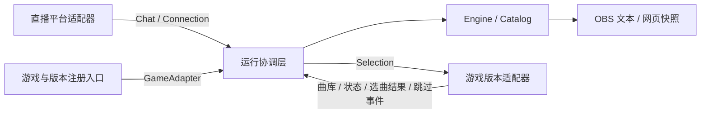

# 适配层与扩展方式

适配层保留原有安装方式、点歌命令、队列行为和 OBS 界面。配置由 GUI 编辑并保存到 SQLite。目标是让新增游戏或版本时，改动集中在适配模块与注册入口；搜索、排队、交互和网页不需要认识游戏内存。

目前仍然只支持 Bilibili 和已验证的 IIDX 33 构建。所有适配器编译在同一个 DLL 内，没有外部插件 ABI、动态插件加载或 Cargo feature 选择要求。

## 模块边界

| 位置 | 职责 |
|---|---|
| `src/platforms/mod.rs` | `ChatSource`、平台无关的消息与连接状态、平台构造入口 |
| `src/platforms/bilibili.rs` | Bilibili 身份、鉴权、WebSocket、心跳、重连、去重 |
| `src/game.rs` | 游戏适配契约与可拥有的数据，不包含内存指针或游戏枚举 |
| `src/games/mod.rs` | 根据已验证指纹模式匹配，构造游戏与版本适配器 |
| `src/games/iidx/mod.rs` | IIDX 的 SP/DP、难度命令、显示颜色与难度编号转换 |
| `src/games/iidx/controls.rs` | IIDX 的对侧 Start 编号与双击识别 |
| `src/games/iidx/v33/` | 当前构建的 hook、结构偏移、曲库解析、原生搜索字典和线程邮箱 |
| `src/host/` | Windows 模块读取与指纹、通用 Spice SDK 按键读取、D3D9 绘制和窗口输入 |
| `src/gui.rs` / `src/live_config.rs` | egui 页面、只读视图与操作命令、配置事务 |
| `src/runtime.rs` | 启停、轮询适配器、分发消息、日志与输出协调 |
| `src/engine.rs`、`src/catalog.rs` | 命令流程、模糊搜索、别名、候选、冷却、队列与超时 |
| `src/overlay.rs`、`web/` | 平台与游戏无关的网页快照及显示 |

上层不导入具体游戏模块。只有注册入口知道有哪些游戏和版本，具体适配器只接收歌曲、模式、谱面、请求 token 和选曲 epoch，不接收观众身份或平台凭据。Engine 的配置也只包含请求、输出及控制策略。

## 契约与线程

`ChatSource` 输出稳定用户标识、昵称、纯文本和明确的连接状态。匿名身份判定、重连与网络协议属于平台适配器；核心不解析平台 ID 或根据提示文字判断是否连接成功。当前只选择一个消息来源。

`Song` 包含适配器提供的歌曲 ID、标题、搜索词和任意数量的可用谱面。`Mode` 与 `Chart` 是不透明的标识；核心只比较，不解释 SP/DP，也不假定每首歌有十个谱面。歌曲 ID 使用 `u32`，其他原生键类型由适配器在内部映射。适配器通过 `GameRules` 定义难度命令、用法提示与通用颜色标记。

谱面等级保存为适配器格式化的文字，可表达整数、小数或命名等级；核心不假定等级上限或精度。

`GameAdapter` 提供以下操作：

- `catalog` / `take_search_index`：返回独立拥有的曲库与补充搜索词。曲库未就绪返回 `None`。
- `poll`：返回场景、模式、选曲 epoch、累计开曲次数、选曲结果与输入事件。IIDX 的对侧 Start 产生 `toggle_menu`，不再产生跳过事件。一次性事件在读取时取走。
- `submit`：提交选曲意图，不能在工作线程直接调用游戏函数。当前 IIDX 适配器将请求放入邮箱，由选曲线程处理。
- `set_skip_target`：告诉适配器当前可跳过的请求 token。是否能识别跳过动作由适配器通过 `can_skip` 表达。
- `diagnostics` / `disabled` / `stop`：提供诊断与生命周期控制。`stop` 后停止自定义工作，hook 回调仍须保持有效并继续原游戏流程。

一次只允许一个选曲请求在途。`SelectionResult` 携带原 token：成功才从等待队列移除；错误提示并移除该请求；`None` 表示场景变化等暂时无法执行，保留请求等待重试。`epoch` 用于拒绝上一次选曲场景遗留的操作。累计开曲次数避免工作线程漏掉短暂的游戏状态切换。

IIDX 内部处理单人 SP、1P/2P、对侧 Start 与双击窗口，向上层发出 `toggle_menu` 与通用 `Navigation` 事件。`set_menu_open` 告知适配器是否启用输入隔离。图形界面不知道游戏按键编号或内存偏移。原有通用跳过事件接口保留，当前 IIDX 不再使用；GUI 的跳过和删除操作由工作线程按 token / epoch / 在途状态验证。

渲染线程通过有界命令通道请求修改；工作线程独占配置、引擎、文件和网络任务，并发布独立拥有的视图快照。Spice SDK v0.4 的 D3D9 回调负责串行化渲染和恢复游戏状态。`INVALIDATE` 释放所有默认池纹理；CPU 图像保留用于重建；`DESTROY` 释放所有设备资源。WindowProc 只收集输入，不获取游戏或渲染器锁。

`live_config::Store` 使用 SQLite 事务保存配置：`settings` 保存全局设置、持久版本号和默认档案引用，`stream_profiles` 单独保存直播平台及其连接设置，`stream_cards` 用唯一卡号关联个人档案。schema 2 原地迁移 schema 1，将原默认连接保留为全局档案。个人档案使用稳定 UUID；凭据和卡号不写入全局设置 JSON。读取所有表也持有同一个事务快照。

游戏适配器在 `GameUpdate.player_card` 中提供经过登录状态检查的自有卡号值，内存偏移和字节序只存在于 IIDX 33 模块。`profiles::ActiveStream` 按卡号选取个人档案，无匹配或无明确登录玩家则选择全局档案。切换档案时取消原生待执行选曲，清空引擎队列、当前项、候选、冷却与 GUI 历史；选曲 token 继续递增，丢弃旧回执。只修改其他档案或在同一档案的卡号之间切换不重连、不清空。

GUI 创建个人档案先产生绑定当前卡号的草稿；应用动作携带该卡号，由 worker 再次核对登录态。所有档案与绑定在一次配置事务中提交，冲突、登录变化或保存失败保持原配置。界面里的档案选择只选择编辑目标，实际连接始终按卡号决定。JSON v2 备份包含全部档案和绑定，同时接受旧 v1 备份。

保存前校验别名、路径和服务，并在事务中再次检查版本号，防止独立预览和 DLL 覆盖彼此的更新。原始相对路径留在数据库，运行时解析为绝对路径。模块和曲库设置可保存，但当前游戏绑定保留到下次启动。新库使用内置默认值；存在同名旧 TOML 时一次性迁移，成功后不再读取旧文件。JSON 导入只产生编辑草稿，导出读取已提交设置。

`bilimani-config.exe` 通过 `host::desktop` 创建 Win32/D3D9 窗口，复用 `host::menu` 的渲染、输入以及全部 `gui` 页面。`desktop::Backend` 只处理配置命令，不启动游戏 Hook、直播连接、点歌引擎或 OBS 服务。默认数据库相对于 EXE，工作目录不影响配置位置；`--config` 可显式指定其他数据库。独立窗口打开时进入直播连接页，创建未绑定档案并允许手动添加卡号；游戏内创建档案的登录校验保持有效。

可选 `song_catalog` 表保存按绑定 `Game` 设置分组的歌曲 ID/标题缓存，不改变设置 revision、schema 2 或 JSON 备份格式。DLL 成功解析曲库后更新缓存；缓存失败只记日志，不影响游戏。EXE 的显式曲库路径优先使用 IIDX 33 文件解析器，路径为空才使用缓存。新增或修改别名使用同一 `Catalog` 校验；无曲库时允许其他设置和删除旧别名。EXE 保存不会自动改变 DLL 内存状态，需游戏内刷新或下次启动加载。

网络通过 `platforms::session::Session` 先结束旧会话再连接新会话，重连过程不阻塞引擎。OBS 的 HTTP 接口提供公开队列状态与容量受限的弹幕／事件记录，不暴露数据库、配置、凭据或观众平台 ID。worker 独立持有 `overlay::History`，按顺序记录弹幕及 `Engine::take_notices` 取出的事件，通知记录不依赖文本提示的过期时间；切换档案时一同清空。每条公开记录有递增序号，轮询无需用时间或文本去重。

网页根据 `chart_style` 渲染颜色，不从难度名称推测游戏规则。此字段是 `/api/state` 当前项、队列项和候选请求上的新增展示字段，原有字段保持不变；现有 IIDX 的文字、颜色和布局保持原样。

## 新增游戏版本

1. 在对应游戏目录下新增独立构建模块，例如 `games/iidx/v33_update/`。确实相同的命令或输入规则可复用 `games/iidx` 的实现。
2. 在新模块实现 `GameAdapter`，封装该构建的曲库布局、函数 ABI、偏移、场景判断与游戏线程通信。结构或调用约定不同也留在该模块中处理。
3. 在 `games/mod.rs` 增加 profile 与指纹匹配分支，构造新适配器。不要在 Engine、Catalog、runtime 或网页增加版本判断。
4. 校验文件指纹与内存入口特征，再安装 hook。补充适配测试和分析记录，并在对应游戏中验证实际选曲、开曲及跳过。

当前仍以精确 SHA-256 选择构建，未知构建拒绝安装。AVS 软件版本仅作为兼容性说明，尚未用于自动识别；版本标签不能替代二进制验证。若以后增加 AVS 探测，探测与匹配只应进入宿主/注册入口，不传播到核心。

## 新增游戏或平台

新增游戏时创建 `games/<game>/`，提供自己的模式、谱面命令、曲库和版本适配器，再在注册入口加入匹配。没有跳过手势的游戏可以始终报告 `can_skip = false`。新游戏的按钮编号、谱面布局和错误提示均由自身模块负责。

新增直播平台时创建 `platforms/<platform>.rs` 并实现 `ChatSource`，在 `SourceConfig` / `create`、直播档案持久化和 GUI 入口中增加该平台，并通过 `redaction_secrets` 提供日志需要脱敏的凭据。不要让 Engine 按平台分支。

`tests/adapters.rs` 使用独立测试平台及虚拟游戏，验证非 SP/DP 模式、超过十个谱面、不同难度命令、较高等级、搜索词、连接状态、显示颜色、选曲确认/重试和跳过流程。它验证抽象边界；真实 IIDX 的协议、队列、曲库、输入及网页测试继续保留。测试适配器不进入发布 DLL，也不代表已经支持其他游戏。
